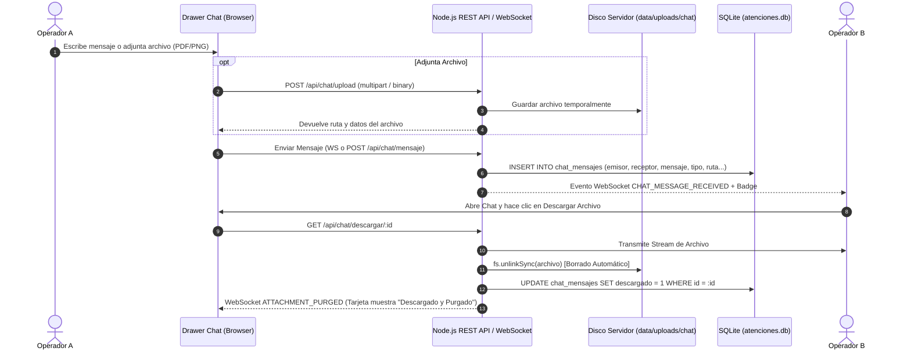

# 🏛️ Especificación de Diseño: Chat Directo 1-a-1 con Transferencia Temporal de Archivos

**Fecha**: 12 de Agosto, 2026  
**Estado**: Aprobado por el usuario  
**Proyecto**: `equipo-gestion` (Ministerio Público de la Defensa - Mendoza)  

---

## 📌 1. Visión General y Objetivos

Esta especificación define la arquitectura e implementación del módulo de **Chat Interno Directo 1-a-1** con soporte para mensajería instantánea y **transferencia efímera de archivos adjuntos** entre operarios y administradores de la Defensoría Pública.

### Principales Funcionalidades:
1. **Mensajería Directa 1-a-1**: Conversaciones privadas bilaterales entre usuarios autenticados.
2. **Transferencia de Archivos Adjuntos (hasta 15 MB)**:
   - Soporte para documentos (PDF, DOCX, XLSX, TXT), imágenes (PNG, JPG, WEBP) y archivos comprimidos (ZIP).
   - Almacenamiento temporal en `data/uploads/chat/`.
   - **Borrado Automático**: Cuando el receptor completa la descarga de un archivo, el servidor lo elimina inmediatamente del disco del servidor (`fs.unlinkSync`) y actualiza el estado del registro a `descargado = 1`.
3. **Persistencia e Historial SQLite**: Todos los mensajes se guardan en la tabla `chat_mensajes` para permitir ver el historial y marcar badges de no leídos.
4. **Notificaciones Real-Time vía WebSocket**: Transmisión instantánea de mensajes, avisos de no leídos y estado en línea/desconectado de operarios.
5. **UI Aero Glass Drawer Desplegable**: Panel lateral flotante accesible en todo momento mediante un botón en la barra superior con badge de mensajes sin leer.

---

## 🏗️ 2. Arquitectura y Flujo de Datos



---

## 🗄️ 3. Esquema de Base de Datos y Endpoints API

### A. Tabla SQLite `chat_mensajes`
```sql
CREATE TABLE IF NOT EXISTS chat_mensajes (
    id INTEGER PRIMARY KEY AUTOINCREMENT,
    emisor_username TEXT NOT NULL,
    receptor_username TEXT NOT NULL,
    mensaje TEXT,
    tipo TEXT DEFAULT 'TEXT', -- 'TEXT' o 'FILE'
    archivo_nombre TEXT,
    archivo_ruta TEXT,
    archivo_tamano INTEGER,
    archivo_mime TEXT,
    descargado INTEGER DEFAULT 0, -- 0: Pendiente, 1: Purgado del disco
    leido INTEGER DEFAULT 0,      -- 0: No leido, 1: Leido
    created_at DATETIME DEFAULT CURRENT_TIMESTAMP
);

CREATE INDEX IF NOT EXISTS idx_chat_users ON chat_mensajes(emisor_username, receptor_username);
```

### B. REST API Endpoints
1. `GET /api/chat/historial?con={username}`: Obtiene los mensajes intercambiados con el usuario especificado.
2. `POST /api/chat/upload`: Recibe un archivo adjunto mediante multipart/form-data o raw buffer HTTP headers.
3. `GET /api/chat/descargar/:id`: Sirve el archivo al usuario autorizado y ejecuta la purga en disco.
4. `POST /api/chat/marcar-leidos`: Marca como leídos los mensajes recibidos de un remitente.
5. `GET /api/chat/unread-count`: Retorna el conteo global de mensajes sin leer agrupados por emisor.

---

## 🎨 4. Interfaz de Usuario (UI/UX Aero Glass Drawer)

### A. Botón de Acceso en Barra de Aplicación / Topbar
- Botón `#btnOpenChatDrawer` con icono `ri-chat-3-line` y badge dinámico de mensajes no leídos (`#chatUnreadBadge`).

### B. Drawer Flotante (`#chatDrawer`)
- Despliegue desde la derecha con animación Aero Glass (`backdrop-filter: blur(20px)`).
- **Sub-panel 1 (Lista de Contactos)**: Muestra la lista de operarios, avatar con indicador de presencia en tiempo real (Punto verde = En línea) y badge de mensajes no leídos por operario.
- **Sub-panel 2 (Ventana de Conversación 1-a-1)**:
  - Header con nombre del operario remoto y estado.
  - Área de mensajes scrolleable con burbujas emisor/receptor.
  - Previsualización de imágenes adjuntas.
  - Tarjetas de archivo descargables (`PDF`, `DOCX`, `ZIP`) con tamaño y botón de descarga. Si ya fue descargado, muestra `✅ Descargado y Purgado del Servidor`.
  - Input de texto + Botón de Adjuntar Archivo (`ri-attachment-line`) + Botón de Enviar (`ri-send-plane-fill`).

---

## 🧪 5. Plan de Verificación

1. **Verificación de Mensajería 1-a-1**:
   - Enviar mensajes de texto entre dos operarios (ej: `spereyra` y `aalonso`).
   - Verificar persistencia en SQLite y recepción instantánea por WebSocket.
2. **Verificación de Adjuntos y Borrado Automático**:
   - Adjuntar un archivo PDF/imagen de 2 MB y enviar al operario remoto.
   - Confirmar que el archivo existe en `data/uploads/chat/`.
   - Descargar el archivo desde la sesión del receptor.
   - Confirmar que `fs.existsSync(archivo_ruta)` devuelve `false` (purga exitosa) y en SQLite `descargado = 1`.
3. **Build & Bundle Check**:
   - Ejecutar `npm run build` para asegurar la compilación de `dashboard-bundle.js`.
