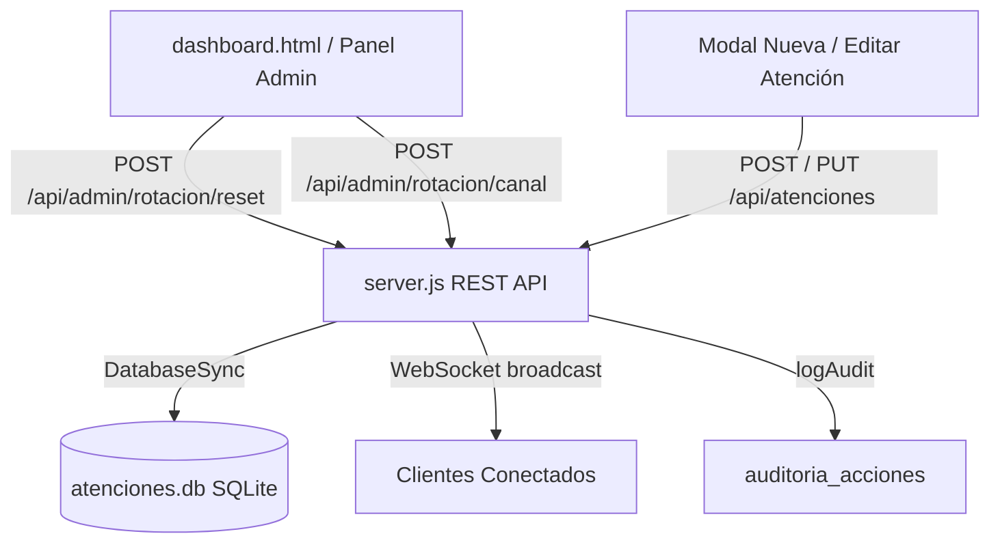

# 🏛️ Especificación de Diseño: Módulo de Co-Defensorías de Familia, Rotación Round-Robin por Canales y Consolidación de Ediciones

**Fecha**: 12 de Agosto, 2026  
**Estado**: Aprobado por el usuario  
**Proyecto**: `equipo-gestion` (Ministerio Público de la Defensa - Mendoza)  

---

## 📌 1. Visión General y Objetivos

El módulo de **Co-Defensorías de Familia** y asignación de turnos es el componente más complejo del sistema de gestión de atenciones. Esta especificación define la solución integral para:

1. **Consolidar la función `handlePutAtencion` en `server.js`**: Eliminar la definición duplicada que actualmente borra o ignora los campos `codefensora_asignada`, `modo_derivacion_familia` y `fecha_vencimiento_contestacion` al editar un registro existente.
2. **Refinar el flujo de atenciones (Nuevos vs. Recurrentes)**:
   - **Causa en Trámite**: Mantiene la Co-Defensora asignada en el historial/expediente del ciudadano para garantizar la continuidad de la defensa, **sin avanzar el puntero de rotación Round-Robin**.
   - **Causa Nueva / Asesoramiento General**: Asigna turno por el algoritmo Round-Robin del canal seleccionado entre las Co-Defensoras actualmente presentes, **avanzando la rotación únicamente al momento de guardar**.
   - **Flexibilidad del Operador**: Permite al operador modificar libremente la Co-Defensora sugerida en cualquier momento o resolver la consulta en mesa sin derivar.
3. **Gestión de Ausencias en Causas en Trámite**: Si la Co-Defensora previa de una *Causa en Trámite* figura como `Ausente`, el sistema despliega un aviso destacado de alerta en el formulario (`⚠️ Dra. [Nombre] figura Ausente por [Motivo]`), permitiendo al operador resolver o re-asignar a otra Co-Defensora presente.
4. **Controles de Administración para Rotación**:
   - Botón de **Reiniciar Rotación a Cero** en la pestaña de Configuración (Admin).
   - Panel de ajuste manual para que el Administrador pueda definir o corregir la Co-Defensora inicial de cada uno de los 4 canales (`ASESORAMIENTO_GENERAL`, `CAUSA_NUEVA`, `CONTESTACION_DEMANDA`, `ADOPCION`).

---

## 🏗️ 2. Arquitectura y Componentes Afectados



### Componentes a Modificar:
1. **`server.js`**:
   - Eliminar la segunda función `handlePutAtencion` (línea 853).
   - Actualizar la función única `handlePutAtencion` para incluir `modo_derivacion_familia`, `codefensora_asignada` y `fecha_vencimiento_contestacion` en la sentencia `UPDATE atenciones SET ...`, emitir auditoría y broadcast WebSocket.
   - Agregar endpoints `POST /api/admin/rotacion/reset` y `POST /api/admin/rotacion/canal`.
2. **`build-bundle.js`** (y consecuentemente `dashboard-bundle.js` / `src/`):
   - Actualizar la vista del modal de atención para mostrar el mensaje de alerta destacado cuando una Co-Defensora previa está ausente en causas en trámite.
   - Agregar en la pestaña de Configuración (Admin) la sección interactiva *"Gestión de Rotación de Turnos de Familia"*.
   - Implementar las llamadas API a los nuevos endpoints de administración de rotación.
3. **`dashboard.html`**:
   - Agregar el contenedor UI dentro del tab de Configuración Admin para la gestión y ajuste de rotación de turnos.

---

## 🗄️ 3. Contratos de API y Esquema de Datos

### A. Endpoint `PUT /api/atenciones` (Consolidado)
- **Método**: `PUT`
- **Body JSON**:
  ```json
  {
    "id": 123,
    "fecha": "12/08/2026",
    "actividad": "Atención Personal",
    "dni": "12345678",
    "apellidos": "GONZALEZ",
    "nombres": "MARIA",
    "celular": "2615551234",
    "expte": "12345/26",
    "motivo": "Divorcio",
    "defensoria": "CO-DEF. FAMILIA",
    "resultado": "Deriva a CO-DEF- FAMILIA",
    "observaciones": "Observación editada",
    "atendidoPor": "A. Alonso",
    "derivadoA": "",
    "escritos": "",
    "tareaPendiente": false,
    "detallePendiente": "",
    "modoDerivacionFamilia": "Causa en Trámite",
    "codefensoraAsignada": "Andrea Lombard",
    "fechaVencimientoContestacion": "",
    "operatorId": 2
  }
  ```
- **Respuesta Exito**: `{ "success": true, "message": "Atención actualizada correctamente" }`

### B. Endpoint `POST /api/admin/rotacion/reset`
- **Método**: `POST`
- **Body JSON**: `{ "adminOperatorName": "Sergio M. Pereyra (ADMIN)" }`
- **Efecto**: Ejecuta `UPDATE rotacion_turnos_canales SET last_index = -1;` en SQLite.
- **Respuesta Exito**: `{ "success": true, "message": "Rotación de turnos reiniciada a cero para todos los canales" }`

### C. Endpoint `POST /api/admin/rotacion/canal`
- **Método**: `POST`
- **Body JSON**:
  ```json
  {
    "canal": "CAUSA_NUEVA",
    "lastIndex": 1,
    "adminOperatorName": "Sergio M. Pereyra (ADMIN)"
  }
  ```
- **Efecto**: Ejecuta `UPDATE rotacion_turnos_canales SET last_index = ? WHERE canal = ?;`
- **Respuesta Exito**: `{ "success": true, "message": "Turno del canal CAUSA_NUEVA actualizado correctamente" }`

---

## 🎨 4. Interfaz de Usuario y Experiencia de Usuario (UI/UX)

### A. Alerta de Co-Defensora Ausente en Causa en Trámite
Cuando el operador selecciona `CO-DEF. FAMILIA` y `Causa en Trámite`, si la Co-Defensora asignada en la causa previa se encuentra con `is_presente = 0`:
- El contenedor de la sugerencia cambia a un tono ámbar resplandeciente (`background: rgba(245, 158, 11, 0.15); border: 1px solid #F59E0B; color: #FBBF24`).
- Texto explicativo: `⚠️ Atención: La Dra. [Nombre] (asignada previamente a este expediente) figura Ausente por [Motivo]. Puede re-asignar a otra Co-Defensora presente o resolver en mesa.`

### B. Sección de Administración de Rotación en Tab Configuración
En el tab de Configuración para el Administrador (`spereyra`):
- **Tarjeta Aero Glass**: "🏛️ Rotación de Turnos - Co-Defensorías de Familia".
- **Tabla / Grid con 4 Canales**:
  - `Asesoramiento General` | Turno Próximo Actual: Dra. Mariela Fokszek | Selector para ajustar turno inicial.
  - `Causa Nueva` | Turno Próximo Actual: Dra. Andrea Lombard | Selector para ajustar turno inicial.
  - `Contestación de Demanda` | Turno Próximo Actual: Dra. Mariela Fokszek | Selector para ajustar turno inicial.
  - `Adopción / Guarda` | Turno Próximo Actual: Dra. Andrea Lombard | Selector para ajustar turno inicial.
- **Botón Destacado**: `[ 🔄 Reiniciar Todos los Turnos a Cero ]` con confirmación previa modal.

---

## 🧪 5. Plan de Verificación y Pruebas

1. **Verificación de Consolidación `handlePutAtencion`**:
   - Editar una atención existente asignada a `CO-DEF. FAMILIA`.
   - Modificar la `codefensora_asignada` y `modo_derivacion_familia`.
   - Guardar y recargar la página (`F5`). Confirmar en SQLite que los campos persisten correctamente.
2. **Verificación de Ausencias en Causa en Trámite**:
   - Marcar a una Co-Defensora (ej: Dra. Lombard) como `Ausente`.
   - Cargar un DNI con antecedente de la Dra. Lombard y seleccionar `Causa en Trámite`.
   - Verificar la aparición de la pill de advertencia en color ámbar.
3. **Verificación de Reset y Ajuste de Canales Admin**:
   - Iniciar sesión como `spereyra` e ingresar a Configuración Admin.
   - Pulsar `Reiniciar Rotación a Cero` y verificar que las próximas Co-Defensoras vuelven a la primera Co-Defensora presente en el roster.
   - Ajustar manualmente un canal a una Co-Defensora específica y verificar que la respuesta del endpoint `proximo-turno` refleja dicho ajuste de inmediato.
4. **Build & Bundle Check**:
   - Ejecutar `npm run build` para asegurar la compilación de `dashboard-bundle.js`.
